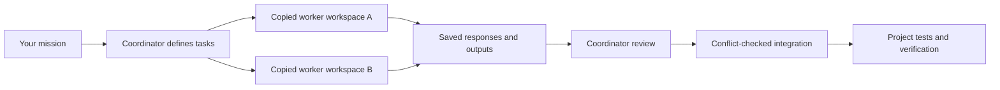

# Project Swarm

**Give one coordinator a mission. Let scoped workers handle independent pieces. Review and integrate the results.**

Project Swarm is a reusable agent skill and dependency-free Node.js runner for coordinating fresh Claude Code workers inside a project. It grew out of a real website build: Claude implemented commerce pages, then a reusable worker pool helped review rendering and scroll animation.

It is designed for a human or coding agent acting as the coordinator. The coordinator decides the tasks, supplies context, reviews findings, integrates changes, and verifies the final product.

## Start here

You need **Node.js 20.3+**, macOS/Linux/WSL, and an installed, authenticated **Claude Code CLI** that supports the required restricted-mode flags. The compatibility check tells you if your CLI is suitable. Native Windows process cleanup is not supported.

Clone this private repository using an account with access:

```sh
git clone https://github.com/Btabor11/project-swarm.git
cd project-swarm
npm test
npm run check
npm run doctor
```

There are no npm dependencies to install. Tests use fake local workers and make no model calls. `doctor` checks CLI compatibility; the next step verifies actual authentication and model access:

```sh
node tools/swarm.mjs validate examples/smoke.json
node tools/swarm.mjs run examples/smoke.json
```

The run prints an ID. Inspect the responses in `.swarm/runs/<run-id>/`, then inspect proposed files before importing them:

```sh
node tools/swarm.mjs status <run-id>
node tools/swarm.mjs inspect <run-id>
# Read each response.txt and the proposed file in its copied workspace.
node tools/swarm.mjs integrate <run-id>
```

A successful smoke run produces `coordination/swarm-handshake.md` after integration. Each live worker uses your existing Claude access and consumes provider usage. A host environment may require network execution approval.

## Drop it into another project

From this toolkit checkout:

```sh
node tools/install.mjs /absolute/path/to/your-project
```

The installer copies the runner, its core tests, the agent skill, example assignments, reference docs, and license notices. It checks every destination first and refuses to overwrite a different file. Reinstalling identical files is safe. It does not change package scripts, global settings, credentials, or the target's Git remote.

Add `.swarm/` to the target project's `.gitignore`. Then, in that project:

```sh
node tools/swarm.mjs doctor
node tools/swarm.mjs validate coordination/swarm-smoke.json
node tools/swarm.mjs run coordination/swarm-smoke.json
```

Alternatively, keep one toolkit checkout and explicitly select a target project:

```sh
node /path/to/project-swarm/tools/swarm.mjs --root /path/to/project validate coordination/my-tasks.json
```

Manifest filenames and all context/output paths resolve inside the selected project. Without `--root`, the project is the parent of the installed `tools/` directory, regardless of your shell's working directory.

## Ask your coding agent to coordinate

After installation, give the coordinator a prompt like:

> Read `skills/project-swarm/SKILL.md`. Use Project Swarm to improve this feature. Split independent work into focused assignments, give each output one writer, review the workers' responses, integrate appropriate changes, and run the project's checks. Keep all work inside this repository.

The skill is project-local and can be read explicitly. It is not automatically installed into a product's global skill-discovery directory. See [setup](docs/setup.md) for setup and sharing details.

## What happens during a run



- Each worker gets explicitly listed files and declared output ownership.
- Up to three fresh CLI processes can run concurrently. They do not attach to existing terminal sessions.
- Reading jobs have Read/Glob/Grep; writing jobs also have Write/Edit. Shell, agent, browser integration, and MCP tools are disabled by the adapter.
- Integration imports only declared files, rejects missing output/deletions, checks content and permission conflicts, and preserves existing executable bits.
- Prompts, responses, provider logs, resolved model identifiers, usage, and reported cost remain in the local run directory.
- The coordinator handles follow-up rounds by explicitly passing earlier responses into a new assignment. Workers do not maintain a shared conversation or coordinate themselves.

Copied workspaces and guarded integration are **not an operating-system security sandbox**. Read [the scope and threat model](SECURITY.md) before using sensitive source. Keep secrets out of worker context.

## A real assignment

```json
{
  "version": 1,
  "concurrency": 2,
  "jobs": [{
    "id": "render-review",
    "agent": "claude",
    "model": "sonnet",
    "prompt": "Review this renderer for concrete performance problems. Write evidence-based findings; do not edit the source.",
    "context": ["src/renderer.js"],
    "outputs": ["coordination/render-review.md"],
    "timeoutMs": 180000
  }]
}
```

Replace paths with files that exist in your project. An empty `outputs` array makes a reading-only job. Omit `model` to preserve the installed CLI's default. Model aliases resolve through your provider and may change; run records capture the actual model identifier when returned.

## Commands

- `doctor` — check Node/platform and Claude flag compatibility; no model call.
- `validate <manifest>` — check schema, paths, files, and size limits; no run or model call.
- `run <manifest>` — start workers and save the exchange.
- `status <run-id>` — read progress, errors, and model metadata.
- `inspect <run-id>` — inspect proposed outputs and conflicts without importing.
- `integrate <run-id>` — import reviewed, declared outputs from a successful run.
- `cancel <run-id>` — request shutdown of that runner's owned workers.
- `--root <project>` — explicitly choose the project, before or after the command.

## Learn, modify, and share

- [Setup and troubleshooting](docs/setup.md)
- [Workflow recipes and coordinator prompts](docs/workflows.md)
- [Manifest and command reference](docs/manifest-reference.md)
- [Modifying the runner and adding providers](docs/extending.md)
- [Real-world Forge case study](docs/forge-case-study.md)
- [Contribution guide](CONTRIBUTING.md)
- [Security and limitations](SECURITY.md)
- [Changelog](CHANGELOG.md)

Only the Claude adapter is implemented. Support for a different provider requires an adapter, tests, and a real scoped exchange; changing `agent` in a JSON file does not add provider support.

The repository is private. People need repository access to clone it, or you can give them an archive. The code and documentation are licensed under [Apache 2.0](LICENSE); preserve the license and applicable notices when redistributing. This package includes no Forge website assets, customer data, credentials, or private agent transcripts.
