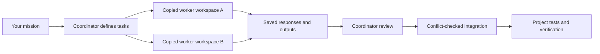

# Project Swarm

**Give one coordinator a mission. Let scoped workers handle independent pieces. Review and integrate the results.**

Project Swarm is a reusable agent skill and dependency-free Node.js runner for coordinating fresh Claude Code, Hermes, and Qwen Code workers plus tool-free OpenAI, Gemini, Ollama, and Lambda API jobs inside a project. It grew out of a real website build: Claude implemented commerce pages, then a reusable worker pool helped review rendering and scroll animation.

It is designed for a human or coding agent acting as the coordinator. The coordinator decides the tasks, supplies context, reviews findings, integrates changes, and verifies the final product.

## Start here

You need **Node.js 20.3+**, macOS/Linux/WSL, and one configured provider. For Claude jobs, use an installed, authenticated **Claude Code CLI** supporting the restricted-mode flags. API jobs use environment credentials (or a local Ollama server), with no Claude installation required. Native Windows process cleanup is not supported.

Clone the public repository. No GitHub account or access invitation is required:

```sh
git clone https://github.com/Btabor11/project-swarm.git
cd project-swarm
npm test
npm run check
node tools/swarm.mjs doctor all
```

There are no npm dependencies to install. Tests use fake local workers and mock HTTP responses; they make no model calls. `doctor all` reports local compatibility/configuration without testing authentication. Start with the Claude smoke below, or choose an API smoke from [provider setup](docs/providers.md):

```sh
node tools/swarm.mjs preflight examples/smoke.json
node tools/swarm.mjs run examples/smoke.json
```

The run prints an ID. Inspect the responses in `.swarm/runs/<run-id>/`, then inspect proposed files before importing them:

```sh
node tools/swarm.mjs status <run-id>
node tools/swarm.mjs inspect <run-id>
# Read each response.txt and the proposed file in its copied workspace.
node tools/swarm.mjs integrate <run-id>
```

A successful smoke run produces `coordination/swarm-handshake.md` after integration. Each live worker uses your own provider access and can consume billable usage. A host environment may require network execution approval.

## Drop it into another project

From this toolkit checkout:

```sh
node tools/install.mjs /absolute/path/to/your-project
```

The installer copies the runner, its core tests, the agent skill, example assignments, reference docs, and license notices. It checks every destination first and refuses to overwrite a different file. Reinstalling identical files is safe. It does not change package scripts, global settings, credentials, or the target's Git remote.

Add `.swarm/` to the target project's `.gitignore`. Then, in that project:

```sh
node tools/swarm.mjs doctor
node tools/swarm.mjs preflight coordination/swarm-smoke.json
node tools/swarm.mjs run coordination/swarm-smoke.json
```

Alternatively, keep one toolkit checkout and explicitly select a target project:

```sh
node /path/to/project-swarm/tools/swarm.mjs --root /path/to/project validate coordination/my-tasks.json
```

Manifest filenames and all context/output paths resolve inside the selected project. Without `--root`, the project is the parent of the installed `tools/` directory, regardless of your shell's working directory.

## Ask your coding agent to coordinate

After installation, give the coordinator a prompt like:

> Read `skills/project-swarm/SKILL.md`. Use Project Swarm to improve this feature. Split independent work into focused assignments, give each output one writer, review the workers' responses, integrate appropriate changes, and run the project's checks. Keep all work inside this repository.

The skill is project-local and can be read explicitly. It is not automatically installed into a product's global skill-discovery directory. See [setup](docs/setup.md) for setup and sharing details.

You can keep one lead orchestrator as your point of contact. The lead supervises optional area managers and scoped workers, then owns review, integration, and final verification. Managers are useful for independent areas; small tasks do not need an extra management layer.

For ongoing use, follow [learning from real work](docs/learning-from-work.md): turn demonstrated failures and measured friction into narrow fixes, meaningful checks, and updated documentation. Keep private project evidence local, use sanitized reproductions upstream, and do not claim faster delivery without measurements.

## Ship smaller pieces

Before dispatch, give every job one coherent deliverable, one owner for each output, and an observable acceptance check. Split a job when it crosses unrelated concerns or has distinct checks that can run independently. Agree on shared interfaces first; run dependent implementation in later batches after reviewed integration. More workers help only when they have independent work.

Use `preflight` to expose context size and snapshot hazards. Group jobs into small batches that can be reviewed and integrated together: one slow job otherwise holds every output in its run. Review completed outputs while peers finish, then run focused tests plus the project integration checks. A manager may propose a plan or review one area, but the coordinator still validates and dispatches workers.

The [connector and village study](docs/connector-swarm-study.md) records observed wait time, changes, and limits. It does not claim a measured speedup without a controlled comparison.

The [mission readiness follow-up](docs/automation-integration-study.md) shows why an automatic workflow needs an eligible worker as well as a ready manager, tests using its bundled prompts, and real provider proof before claiming activation readiness. It records executed checks and distinguishes preparation, activation, execution, and business outcomes.

## What happens during a run



- Each worker gets explicitly listed files and declared output ownership.
- Concurrency defaults to 2 and accepts an explicit 1–32, shared across CLI processes and API requests. They do not attach to existing terminal sessions.
- Claude reading jobs have Read/Glob/Grep; writing jobs also have Write/Edit. API jobs receive only copied UTF-8 text and return validated file contents; they have no tools. Shell, agent, browser integration, and MCP tools are disabled by the adapter.
- Integration imports only declared files, rejects missing output/deletions, checks content and permission conflicts, and preserves existing executable bits.
- Prompts, responses, provider logs, resolved model identifiers, usage, and reported cost remain in the local run directory.
- The coordinator handles follow-up rounds by explicitly passing earlier responses into a new assignment. Workers do not maintain a shared conversation or coordinate themselves.

Copied workspaces and guarded integration are **not an operating-system security sandbox**. Read [the scope and threat model](SECURITY.md) before using sensitive source. Keep secrets out of worker context.

## A real assignment

```json
{
  "version": 1,
  "concurrency": 2,
  "jobs": [{
    "id": "render-review",
    "agent": "claude",
    "model": "sonnet",
    "prompt": "Review this renderer for concrete performance problems. Write evidence-based findings; do not edit the source.",
    "context": ["src/renderer.js"],
    "outputs": ["coordination/render-review.md"],
    "timeoutMs": 180000
  }]
}
```

Replace paths with files that exist in your project. An empty `outputs` array makes a reading-only job. CLI jobs may omit `model` to preserve the installed CLI default; API jobs require an explicit model. Model aliases resolve through your provider and may change; run records capture the actual model identifier when returned.

## Commands

- `doctor [claude|hermes|qwen|openai|gemini|ollama|all]` — check compatibility or environment configuration; no model call. Omitted provider means Claude.
- `validate <manifest>` — check schema, paths, files, and size limits; no run or model call.
- `preflight <manifest>` — validate and flag oversized jobs, repeated context, and snapshot dependencies before dispatch. Warnings support coordinator judgment; they do not automatically split or launch jobs.
- `run <manifest>` — start workers and save the exchange.
- `status <run-id>` — read progress, errors, and model metadata.
- `monitor <run-id>` — concise snapshot of queued/running/completed jobs, observed peak concurrency, timings, numeric usage, and content-free CLI output counters. Silence is not proof that a worker is stuck.
- `inspect <run-id>` — inspect proposed outputs and conflicts without importing.
- `integrate <run-id>` — import reviewed, declared outputs from a successful run.
- `cancel <run-id>` — request shutdown of that runner's owned workers.
- `--root <project>` — explicitly choose the project, before or after the command.

## Learn, modify, and share

- [Active orchestration and monitoring](docs/orchestration.md)
- [Manager task contracts and staged delivery](docs/managed-feature-plan.md)
- [Continuous improvement from real work](docs/learning-from-work.md)
- [Providers, authentication, and API smoke tests](docs/providers.md)
- [Setup and troubleshooting](docs/setup.md)
- [Workflow recipes and coordinator prompts](docs/workflows.md)
- [Manifest and command reference](docs/manifest-reference.md)
- [Modifying the runner and adding providers](docs/extending.md)
- [Automation handoff integration study](docs/automation-integration-study.md)
- [Real-world website case study](docs/case-study.md)
- [Contribution guide](CONTRIBUTING.md)
- [Security and limitations](SECURITY.md)
- [Changelog](CHANGELOG.md)

Seven adapters are implemented: `claude`, `hermes` (Nous Research CLI), `qwen` (Qwen Code CLI), `openai` (Responses API), `gemini` (generateContent), `ollama` (chat API), and `lambda` (OpenAI-compatible chat completions against hosted Lambda Inference or an operator-owned origin). API workers are single-request text/file generators, not interactive coding CLIs. Their contract is tested with mock HTTP responses; this release does not claim live API account/model verification. Claude has a recorded live project-scoped history. See [provider setup](docs/providers.md) for honest capability limits and smoke verification.

Use the included recipes for code review, UI source review, documentation, test planning, four-worker Claude reviews, and mixed-provider reviews. API workers do not see rendered screenshots or run tests. The coordinator performs those checks. Hermes and Qwen use serialized copied context and strict JSON file envelopes; they do not get file-editing tools through this adapter. Their compatibility and authentication must be checked independently. Raising concurrency is opt-in and increases simultaneous resource use; it is not a spending cap.

The repository is public. Anyone can clone it, download a release archive, or fork it. Cloning does not require a GitHub account; creating a fork does. `Btabor11` in the clone URL identifies the repository owner, not an account you need to sign into. Each person uses their own provider authentication for live workers. The code and documentation are licensed under [Apache 2.0](LICENSE); preserve the license and applicable notices when redistributing. This package includes no example website assets, customer data, credentials, or private agent transcripts.
