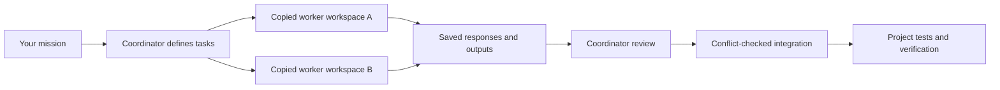

# Project Swarm

**Give one coordinator a mission. Let scoped workers handle independent pieces. Review and integrate the results.**

Project Swarm is a reusable agent skill and dependency-free Node.js runner for coordinating fresh Claude Code, Hermes, and Qwen Code workers plus tool-free OpenAI, Gemini, Ollama, and Lambda API jobs inside a project. It grew out of a real website build: Claude implemented commerce pages, then a reusable worker pool helped review rendering and scroll animation.

It is designed for a human or coding agent acting as the coordinator. The coordinator decides the tasks, supplies context, reviews findings, integrates changes, and verifies the final product.

Codex CLI workers (`codex`) run in per-job git worktrees under a macOS seatbelt sandbox with an explicit model; see [provider setup](docs/providers.md). **The Codex sandbox is macOS-only** (it uses `sandbox-exec`): on Linux, WSL or Windows, `doctor codex` reports unsupported and `run` refuses codex jobs.

## Install (for AI agents)

If a user pastes this repository's URL and asks you to install it, follow these steps exactly. There is **one shared install per machine** at `~/.project-swarm` (override with the `PROJECT_SWARM_HOME` environment variable); every project on the machine links to it instead of getting its own copy.

1. Check prerequisites: `node --version` must be 20.3 or newer, and `git --version` must succeed.
2. Get the shared install onto the newest release:
   - If `~/.project-swarm` does **not** exist yet:
     ```sh
     git clone https://github.com/RDW-Labz/project-swarm ~/.project-swarm
     git -C ~/.project-swarm tag --list 'v*' --sort=-v:refname | head -1
     git -C ~/.project-swarm checkout <the tag printed above>
     ```
   - If `~/.project-swarm` already exists, do not clone again; instead run:
     ```sh
     node ~/.project-swarm/tools/swarm.mjs update
     ```
3. Install the skill for every project on this machine:
   ```sh
   node ~/.project-swarm/tools/install.mjs --user
   ```
4. Check provider compatibility (no model call, no credentials created):
   ```sh
   node ~/.project-swarm/tools/swarm.mjs doctor all
   ```
5. Generate the onboarding summary and relay it to the user in plain words — what the swarm does, which providers are ready, how to ask for work, and what a run looks like:
   ```sh
   node ~/.project-swarm/tools/swarm.mjs onboard
   ```
6. Optional — link the current project so its `coordination/` examples exist and it resolves through the shared install:
   ```sh
   node ~/.project-swarm/tools/install.mjs /absolute/path/to/this/project
   ```

What never happens without the user explicitly asking: no API keys or credentials are ever created, read, or requested; `swarm update` never runs by itself (the skill only asks and waits for a yes); and an old per-project copy is never replaced until the user says yes to `update --projects --yes`.

## Start here

You need **Node.js 20.3+**, macOS/Linux/WSL, and one configured provider. For Claude jobs, use an installed, authenticated **Claude Code CLI** supporting the restricted-mode flags. API jobs use environment credentials (or a local Ollama server), with no Claude installation required. Native Windows process cleanup is not supported.

Clone the public repository. No GitHub account or access invitation is required:

```sh
git clone https://github.com/RDW-Labz/project-swarm.git
cd project-swarm
npm test
npm run check
node tools/swarm.mjs doctor all
```

There are no npm dependencies to install. Tests use fake local workers and mock HTTP responses; they make no model calls. `doctor all` reports local compatibility/configuration without a model call; Codex also checks local login status. Start with the Claude smoke below, or choose an API smoke from [provider setup](docs/providers.md):

```sh
node tools/swarm.mjs preflight examples/smoke.json
node tools/swarm.mjs run examples/smoke.json
```

The run prints an ID. Inspect the responses in `.swarm/runs/<run-id>/`, then inspect proposed files before importing them:

```sh
node tools/swarm.mjs status <run-id>
node tools/swarm.mjs inspect <run-id>
# Read each response.txt and the proposed file in its copied workspace.
node tools/swarm.mjs integrate <run-id>
```

A successful smoke run produces `coordination/swarm-handshake.md` after integration. Each live worker uses your own provider access and can consume billable usage. A host environment may require network execution approval.

## Drop it into another project

Project Swarm uses one shared install per machine (default `~/.project-swarm`, override with `PROJECT_SWARM_HOME`); projects no longer get their own copy of the runner, tests, or skill. Link a project to that install:

```sh
node ~/.project-swarm/tools/install.mjs /absolute/path/to/your-project
```

This writes a small pointer file, `.project-swarm.json`, recording the install root and its version, and registers the project so `swarm update --projects` can find it later. It creates `coordination/` example manifests only if the project has none yet. It does not copy `tools/`, `tests/`, or `skills/` into the project, and does not change package scripts, global settings, credentials, or the target's Git remote.

Add `.swarm/` and `.project-swarm.json`'s sibling `.swarm-old-copy-*/` pattern to the target project's `.gitignore` if you track it. Then, in that project:

```sh
node ~/.project-swarm/tools/swarm.mjs --root . doctor
node ~/.project-swarm/tools/swarm.mjs --root . preflight coordination/swarm-smoke.json
node ~/.project-swarm/tools/swarm.mjs --root . run coordination/swarm-smoke.json
```

`--root` selects one explicit project; manifest filenames and all context/output paths resolve inside it, regardless of your shell's working directory. If a project's `.project-swarm.json` version no longer matches the installed version, `run`/`validate` print one warning to stderr — they still run; use `swarm update` in the install root to realign.

## Updating

`swarm update` moves the shared install itself to the newest release tag; it refuses if you have uncommitted changes in its own `tools/` or `skills/`, and prints `{from, to, changelog}` (or `{from, to, upToDate: true}` if already current). Run `swarm version --check` to see whether a newer tag exists without changing anything. Nothing updates itself: the skill checks once per session and only asks — it runs `update` after the user says yes, never on its own.

Installs are versioned: each install/update snapshots the runtime into its own directory and atomically repoints a `current` symlink at it, so `<source>/current/tools/swarm.mjs` is always the runner path and a run already in flight keeps using its own version even if `update` replaces files underneath it mid-run.

Old per-project copies from before this shared-install model can be found and replaced with a pointer using `swarm update --projects`. Without `--yes` it only reports what it found; with `--yes` it writes the pointer and moves only the files the old installer copied in (the swarm's own `tools/*.mjs`, `tests/*.test.mjs`, `skills/project-swarm/` and `licenses/project-swarm/`; the project's own tools and tests stay) into a timestamped `.swarm-old-copy-*/` folder in that project rather than deleting them. It never touches `coordination/` or `.swarm/`.

## Ask your coding agent to coordinate

After installation, give the coordinator a prompt like:

> Read `skills/project-swarm/SKILL.md`. Use Project Swarm to improve this feature. Split independent work into focused assignments, give each output one writer, review the workers' responses, integrate appropriate changes, and run the project's checks. Keep all work inside this repository.

`node ~/.project-swarm/tools/install.mjs --user` installs the skill into every agent home whose parent directory exists (`~/.claude/skills/project-swarm/`, `~/.codex/skills/project-swarm/`), so a supporting agent can discover it automatically; otherwise read `skills/project-swarm/SKILL.md` explicitly. See [setup](docs/setup.md) for setup and sharing details.

## Ship smaller pieces

Before dispatch, give every job one coherent deliverable, one owner for each output, and an observable acceptance check. Split a job when it crosses unrelated concerns or has distinct checks that can run independently. Agree on shared interfaces first; run dependent implementation in later batches after reviewed integration. More workers help only when they have independent work.

Use `preflight` to expose context size and snapshot hazards. Group jobs into small batches that can be reviewed and integrated together: one slow job otherwise holds every output in its run. Review completed outputs while peers finish, then run focused tests plus the project integration checks. A manager may propose a plan or review one area, but the coordinator still validates and dispatches workers.

The [connector and village study](docs/connector-swarm-study.md) records observed wait time, changes, and limits. It does not claim a measured speedup without a controlled comparison.

The [mission readiness follow-up](docs/automation-integration-study.md) shows why an automatic workflow needs an eligible worker as well as a ready manager, tests using its bundled prompts, and real provider proof before claiming activation readiness. It records executed checks and distinguishes preparation, activation, execution, and business outcomes.

## What happens during a run



- Each worker gets explicitly listed files and declared output ownership.
- Concurrency defaults to 2 and accepts an explicit 1–32, shared across CLI processes and API requests. They do not attach to existing terminal sessions.
- Claude reading jobs have Read/Glob/Grep; writing jobs also have Write/Edit. API jobs receive only copied UTF-8 text and return validated file contents; they have no tools. Shell, agent, browser integration, and MCP tools are disabled by the adapter.
- Integration imports only declared files, rejects missing output/deletions, checks content and permission conflicts, and preserves existing executable bits.
- Prompts, responses, provider logs, resolved model identifiers, usage, and reported cost remain in the local run directory.
- The coordinator handles follow-up rounds by explicitly passing earlier responses into a new assignment. Workers do not maintain a shared conversation or coordinate themselves.

Copied workspaces and guarded integration are **not an operating-system security sandbox**. Read [the scope and threat model](SECURITY.md) before using sensitive source. Keep secrets out of worker context.

## A real assignment

```json
{
  "version": 1,
  "concurrency": 2,
  "jobs": [{
    "id": "render-review",
    "agent": "claude",
    "model": "sonnet",
    "prompt": "Review this renderer for concrete performance problems. Write evidence-based findings; do not edit the source.",
    "context": ["src/renderer.js"],
    "outputs": ["coordination/render-review.md"],
    "timeoutMs": 180000
  }]
}
```

Replace paths with files that exist in your project. An empty `outputs` array makes a reading-only job. Every job, CLI or API, requires an explicit `model`; the runner never falls back to a CLI default. Model aliases resolve through your provider and may change; run records capture the actual model identifier when returned.

## Commands

- `doctor [claude|codex|hermes|qwen|openai|gemini|ollama|all]` — check compatibility or environment configuration; no model call. Omitted provider means Claude.
- `validate <manifest>` — check schema, paths, files, and size limits; no run or model call. A refusal for an uncovered test names exactly which tests to add via `suggestedIgnoreTests: {"<jobId>": ["tests/...", ...]}` in its JSON, ready to paste into `ignoreTests`.
- `preflight <manifest>` — validate and flag oversized jobs, repeated context, and snapshot dependencies before dispatch. Warnings support coordinator judgment; they do not automatically split or launch jobs.
- `run <manifest>` — start workers and save the exchange.
- `ask --model M --context f1,f2,... [--agent claude] [--timeout S] "question"` — build and run one read-only job in memory, wait for it, and print `{"id","status","model","actualModel","modelMismatch","costUsd","result"}` (`result` is the worker's parsed final JSON, or `null` plus `error`). Refuses with no `--model`, no `--context`, or an empty question; `--agent` defaults to `claude` and never allows `codex`. See [the manifest reference](docs/manifest-reference.md#ask).
- `status <run-id>` — read progress, errors, and model metadata.
- `monitor <run-id>` — concise snapshot of queued/running/completed jobs, observed peak concurrency, timings, numeric usage, and content-free CLI output counters. Silence is not proof that a worker is stuck. Add `--view` for a human-readable table instead of JSON, and `--watch [seconds]` to keep it redrawing in place (read-only) until the run finishes:

  ```sh
  node tools/swarm.mjs monitor <run-id> --view --watch 5
  # Run a1b2c3-9f8e — running
  # 1 running · 2 done · 0 failed · 1 queued  ·  elapsed 38s  ·  peak concurrency 2
  #
  # JOB             AGENT   MODEL   TIER  STATUS     TIME  OUT
  # render-review   claude  sonnet  mid   + done      12s    1
  # scroll-anim     claude  -       -     > running    9s    1
  ```
- `inspect <run-id>` — inspect proposed outputs and conflicts without importing; carries a top-level `warnings` array noting any job whose reported model didn't match what was requested. Add `--results` to print just `{"runId","status","warnings":[...],"jobs":[{"id","status","model","actualModel","modelMismatch","costUsd","result"}]}` and nothing else.
- `integrate <run-id>` — import reviewed, declared outputs from a successful run, then run the manifest's optional `checks` (format, tests) right after writing files; add `--no-checks` to skip them or `--require-checks` to fail the command when a check fails. A `checks`/`mutantCheck` argv item may contain `{root}` anywhere inside it, expanding to the run's absolute project root, so parallel runs never share a build/output folder.
- `cancel <run-id>` — request shutdown of that runner's owned workers.
- `ship <run-id> --repo OWNER/NAME --pr payload.json` — for an already-integrated run: push its branch, open or update the pull request, re-run the manifest's `checks` and fill them into the PR body, wait for CI, and merge once green. Refuses on a dirty tree, a failed check, a missing required `--require-section`, or a rejected push; never merges a PR body that opens with a `**needs ` human-review marker. Add `--no-merge` to stop at a green `ready` state, `--merge-method squash|merge|rebase` (default `squash`), or `--timeout`/`--poll` (seconds) to tune CI waiting. See [the manifest reference](docs/manifest-reference.md#ship).
- `go <manifest.json|run-id> [--commit-message MSG] [--repo OWNER/NAME --pr payload.json] [--require-section NAME]... [--mutants] [--merge-method M] [--timeout S]` — one command from a manifest (or an already-started run) to a merged, reviewed change: run and wait (skipped for a run id), integrate with checks, commit exactly that run's integrated files (never `git add -A`) when `--commit-message` is given, then ship when `--repo`/`--pr` are given. Prints one JSON line and exits `0` for `merged`/`held`/`ready`/`integrated`/`committed`, `1` for `failed`. See [the manifest reference](docs/manifest-reference.md#go).
- `version [--check]` — print `{version, installRoot, tag}`; with `--check`, also `latest`/`updateAvailable` from the `origin` remote's tags (or `checkError` if the remote can't be reached). No local files change.
- `update [--projects [DIR...]] [--yes]` — move this shared install to the newest release tag and reinstall the skill; or, with `--projects`, find old per-project copies/stale pointers and replace them with a pointer only when `--yes` is given.
- `onboard` — print a plain-language summary of what the swarm does, which providers are ready on this machine, and how to ask for work; generated from local `doctor` checks, no model call.
- `--root <project>` — explicitly choose the project, before or after the command.

## Learn, modify, and share

- [Active orchestration and monitoring](docs/orchestration.md)
- [Manager task contracts and staged delivery](docs/managed-feature-plan.md)
- [Providers, authentication, and API smoke tests](docs/providers.md)
- [Setup and troubleshooting](docs/setup.md)
- [Workflow recipes and coordinator prompts](docs/workflows.md)
- [Manifest and command reference](docs/manifest-reference.md)
- [Modifying the runner and adding providers](docs/extending.md)
- [Automation handoff integration study](docs/automation-integration-study.md)
- [Real-world website case study](docs/case-study.md)
- [Contribution guide](CONTRIBUTING.md)
- [Security and limitations](SECURITY.md)
- [Changelog](CHANGELOG.md)

Eight adapters are implemented: `codex` (macOS-sandboxed Codex CLI), `claude`, `hermes` (Nous Research CLI), `qwen` (Qwen Code CLI), `openai` (Responses API), `gemini` (generateContent), `ollama` (chat API), and `lambda` (OpenAI-compatible chat completions against hosted Lambda Inference or an operator-owned origin). API workers are single-request text/file generators, not interactive coding CLIs. Their contract is tested with mock HTTP responses; this release does not claim live API account/model verification. Claude has a recorded live project-scoped history. See [provider setup](docs/providers.md) for honest capability limits and smoke verification.

Use the included recipes for code review, UI source review, documentation, test planning, four-worker Claude reviews, and mixed-provider reviews. API workers do not see rendered screenshots or run tests. The coordinator performs those checks. Hermes and Qwen use serialized copied context and strict JSON file envelopes; they do not get file-editing tools through this adapter. Their compatibility and authentication must be checked independently. Raising concurrency is opt-in and increases simultaneous resource use; it is not a spending cap.

The repository is public. Anyone can clone it, download a release archive, or fork it. Cloning does not require a GitHub account; creating a fork does. `RDW-Labz` in the clone URL identifies the repository owner, not an account you need to sign into. Each person uses their own provider authentication for live workers. The code and documentation are licensed under [Apache 2.0](LICENSE); preserve the license and applicable notices when redistributing. This package includes no example website assets, customer data, credentials, or private agent transcripts.
